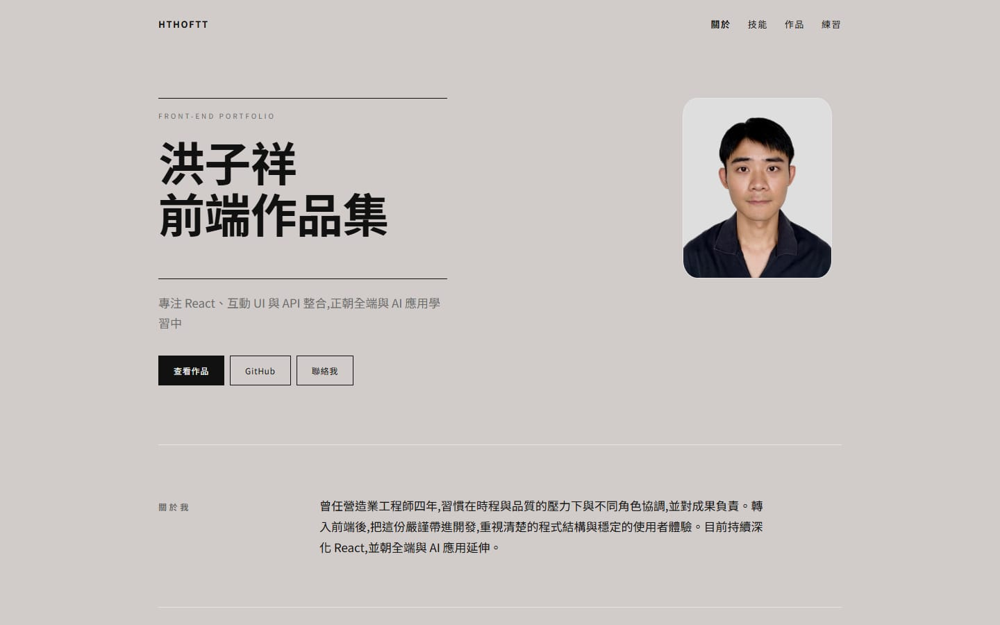

# 洪子祥 前端作品集

個人作品集網站,整理我的前端專案、技能與聯絡方式。

🔗 **線上網站:[hthoftt.github.io](https://hthoftt.github.io/)**

## 網站內容
- 關於我與技能
- 精選作品(附 Demo 與 GitHub 連結)
- 更多練習專案

## 設計重點
- 黑白灰配色,版面簡潔,以內容為主
- RWD:支援桌機、平板與手機
- 純 HTML 與 CSS,不依賴框架,載入快速

## 使用技術
- HTML
- CSS
- GitHub Pages(部署)

## 專案結構
- index.html 頁面內容(含作品 GIF 預覽與複製 email 的小段 JavaScript)
- style.css 樣式
- img/ 個人照與作品截圖

## 本機預覽
1. 用 VS Code 開啟專案資料夾
2. 安裝外掛 Live Server
3. 對 `index.html` 按右鍵,選 Open with Live Server

## 部署
推送到 `main` 分支後,由 GitHub Pages 自動發布,通常一到兩分鐘後生效。

## 聯絡我
洪子祥 · [GitHub](https://github.com/hthoftt) · tonyhung92568@gmail.com
